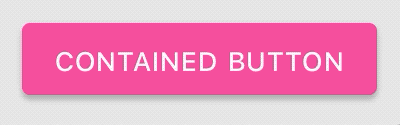
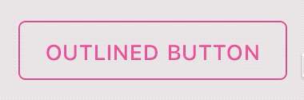
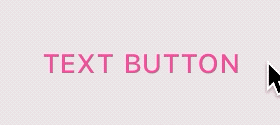

# MaterialUI

[](https://app.bitrise.io/app/a896373cca47856f)

[Material design](https://material.io) components for SwiftUI. 

- [Using MaterialUI](#using-materialui)
- [Hacking on MaterialUI](#hacking-on-materialui)

## Supported Platforms

- macOS 10.15+
- iOS 13+
- watchOS 6+
- ~~tvOS 13+~~ (see issue [#1](https://github.com/chkn/MaterialUI/issues/1))

## Using MaterialUI

Before we begin, note that this project is in the very early stages, and some stuff will probably change. Please feel free to file Issues and Pull Requests.

1. From within your app project in Xcode 11 or newer, choose File -> Swift Packages -> Add Package Dependency
2. Paste the URL of this GitHub repository
3. Click through the remaining steps, choosing which version of MaterialUI you want to track and which targets to add it to
4. See the next section to start styling your views!

### Components

- [Buttons](#buttons)
- [Modifiers](#modifiers)

#### Buttons

There are 3 styles of [material buttons](https://material.io/components/buttons):

- [Contained](#contained)
- [Outlined](#outlined)
- [Text](#text)

The button style is selected with the `buttonStyle` modifier, which may be used on any view to specify the style used for all buttons in that subview hierarchy.

##### Contained

```swift
Button("Contained Button", action: {})
	.buttonStyle(ContainedButtonStyle())
```



##### Outlined

```swift
Button("Outlined Button", action: {})
	.buttonStyle(OutlinedButtonStyle())
```



##### Text

```swift
Button("Text Button", action: {})
	.buttonStyle(TextButtonStyle())
```



#### Color

In iOS and WatchOS, you can set the color through the accentColor modifier

```swift
        Button("Contained Button", action: {})
        .buttonStyle(ContainedButtonStyle())
            .accentColor(Color.green)
```

In MacOS the accentColor modifier is not available, so you can use the materialAccent environment variable
(in fact, you can use this on any platform)


```swift
        Button("Contained Button", action: {})
        .buttonStyle(ContainedButtonStyle())
        .environment(\.materialAccent, Color.red)
```

#### Modifiers

MaterialUI also supplies some modifiers you can apply to any SwiftUI View:

- elevation
- rippleEffect

TODO: Document these.

## Hacking on MaterialUI

To build MaterialUI, simply run `swift build`.

If you are on Mac and prefer to hack in Xcode, you can generate an Xcode project with `swift package generate-xcodeproj`.

### Platform Defines

To deal with cases where the SwiftUI implementation varies by platform, the following can be defined at build time to indicate what APIs are available:

- `HAVE_HOVER` - Enables handling of hover events using the `onHover` modifier.
- `HAVE_DRAG` - Enables handling of mouse down location using `DragGesture`.

See `Package.swift` for the configurations where these are defined.
